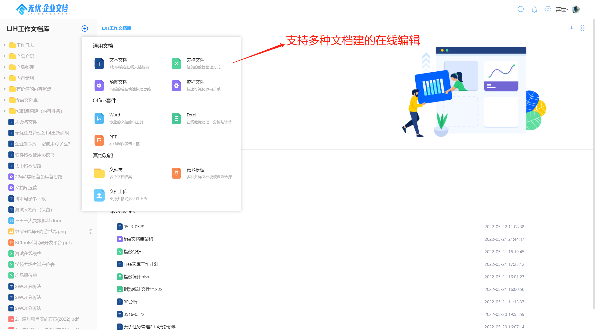
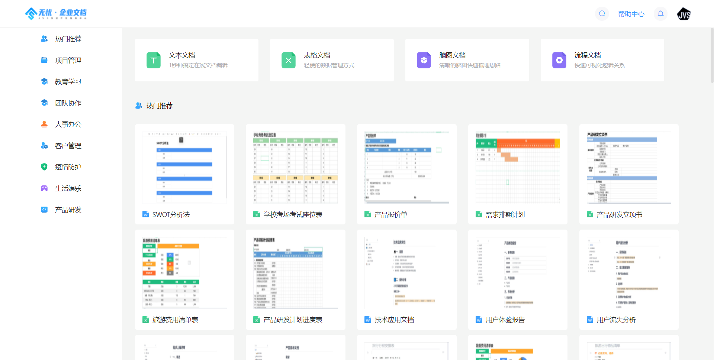
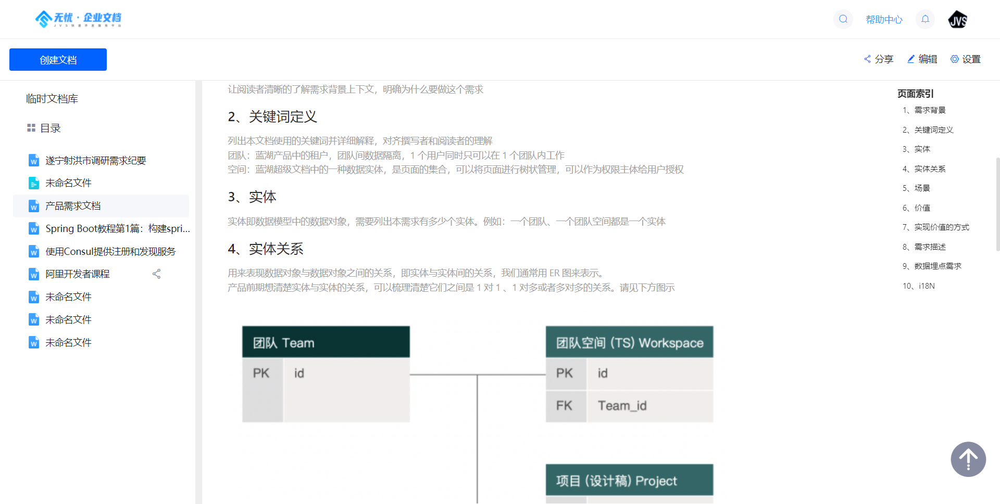
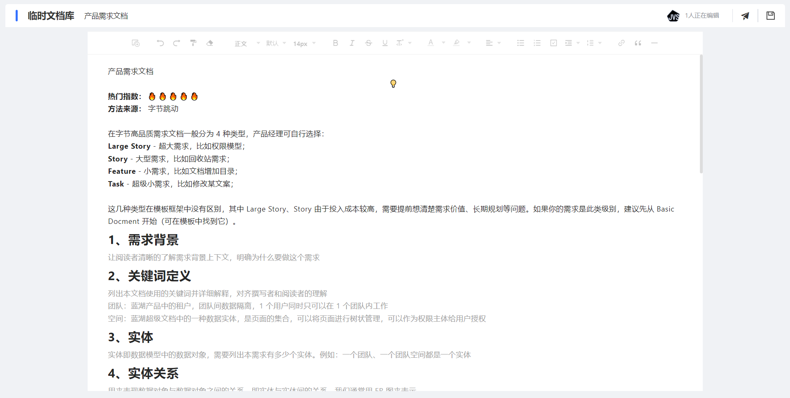
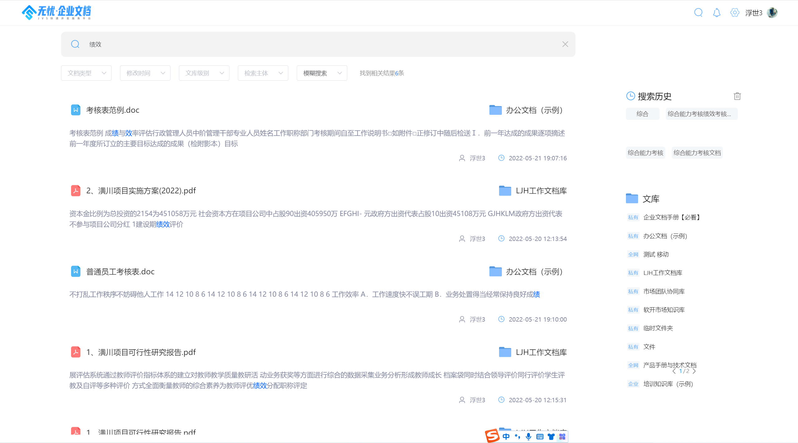
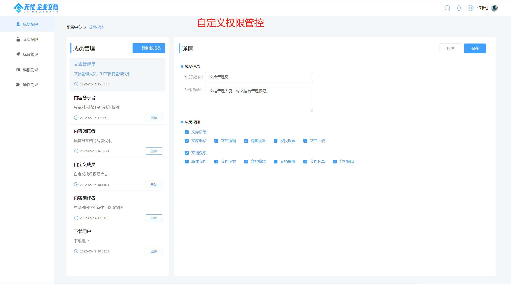

### Applicable scenarios:
*Applicable to enterprises and teams, it provides online notes, knowledge precipitation, online product manuals, knowledge bases, online electronic tutorials and other functions.
###Problems solved:
-* * problem of data capitalization * *: without appropriate document management tools, it is difficult to transform the intangible knowledge of employees into tangible assets of the enterprise, resulting in a waste of a lot of resources in training, learning and display, and the effect is not satisfactory.
-* * unified control of files * *: data files are scattered in employees' computers, so it is difficult to form effective unified control. Unstructured content needs to be managed from the whole process of file generation, use and flow
-* * problem of knowledge flow * *: the flow speed of information is an important guarantee for the efficient operation of enterprises. The deconstructed data is managed by the business system, but the unstructured information is a reliable flow channel, which basically depends on roaring, USB flash disk and inquiry
-* * information retrieval problem * *: because the file is not deconstructed, it is not easy to retrieve and find, which is the lack of an effective enterprise level "Baidu"
-* * information security problems * *: the enterprise cannot effectively manage files at different levels, and there is a risk of information disclosure on the SaaS platform on the Internet. Privatization + internal authority control is the basis
**Worry free · enterprise document = enterprise knowledge base + online editing tool set + enterprise search engine + content display platform**
### Technology stack selection
-Front end: Vue + element UI
-Back end: Spring_ cloud_ alibaba、spring boot、Mybatis plus、Nacos、RabbitMq、Xxl-job
-Data: MySQL, elasticsearch, redis, MariaDB (as appropriate)
-Operation and maintenance: k8s + docker
### Project value
*When using low-cost products with more than 30 users, the cost is lower than SaaS products, and the number of useless households is limited
*Information security, privatization deployment (physical server or private cloud). The core of privatization is data control. There is no data control and it belongs to a third party
*Technology is open, using general technology stack, supporting 100% code opening, supporting secondary development, and will not be kidnapped by any service provider
*Corporate operation. The project is a company level commercial operation project and an important guarantee for continuous iteration and support services of the project
*Technical support, the team supporting the project promotion belongs to senior personnel in the industry
*Expansibility thinking: the project is a part of the enterprise's digital transformation. It has learned a lot from the experience of nailing, flying book and other large platforms, made a lot of tailoring and adjustment to the Internet and C-end related capabilities, and absorbed a lot of ideas and experience of to B product design.
### Core functions:
*Integrate multiple file editors (rich text editor, online form, online brain map, online flow chart, etc., and the editor will continue to expand)
*Preview and analysis of various files (preview of PDF, word, PPT, Excel and other files)
*Collaborative editing of core documents (rich text and online forms)
*Support teamwork ()
*Provide enterprise search engine (title based, content-based)
*Support document content comments and document collection
*Support document sharing (password secondary verification setting)
*Support document templates
*Enterprise level organizational structure and authority management (rigid organization + flexible group)
#### Corpus (knowledge base) management
*The whole station intelligent search engine supports document level and content level retrieval
*Addition, deletion, modification and query of Anthology
*Collaboration of team members of the collection (viewable and editable)
*Directory structured management of Anthology
*Basic introduction of the anthology
*Participants and collaborators of knowledge base
*Support multi role collaboration (member, manager, owner)
#### Document management:
*Support rich text (word like), brain map (XMIND like) and flow chart (VISO like)
*Addition, deletion, modification and query of documents, online editing of documents
*Document sharing settings
#### Rich text editing:
*Text outline, subtitle navigation
*Support WYSIWYG
*Support form
*Support rich text expression plug-ins such as pictures, tables, third-party applications, audio, video, etc
*Support code block, reference
*Support source code viewing
## Project composition
Enterprise documents are divided into business foreground and management background. The project is composed of business foreground and business background:
-Business front end address: https://gitee.com/software-minister/jvs-knowledge-ui
-Business front end address: https://gitee.com/software-minister/jvs-apply-document
-Management background front end address: https://gitee.com/software-minister/jvs-ui
-Back end address of management background: https://gitee.com/software-minister/jvs
## Demo address
Demo address: http://knowledge.bctools.cn/ 

Trial account: you can log in by scanning the wechat code. If you need to try the account password, please contact us with QR code
Partial screenshot:

-

-

-

### Rapid deployment document
https://gitee.com/software-minister/jvs-docker-compose/blob/master/readme.md
### Use and authorization
The worry free enterprise document community version is 100% open source. Under the condition of compliance filing, it supports self-use and commercial use, and commercial use provides 100% source code.
### Version Description:
Use purpose | fee mode | use conditions | authorization time
-|-|-|-
Individual study | free | free filing | permanent
Commercial, secondary development | charge, code delivery | technical service contract + Commercial filing | permanent
### Description of commercial expenses:
>Technical service fee, required. Please contact the business department for the specific fee
>Customized development fee, optional, 1500 yuan/person day
>Deployment cost, optional, 500 yuan/time
>Long term operation and maintenance, optional, negotiation
Filing instructions: contact our business personnel for online filing. Filing content: project name, use mode (self use/commercial use), filing subject, filing contact personnel.
### Prohibited behaviors (to ensure the product goes further):
*Code distribution in any form (including but not limited to code copy, code disclosure, code open source, code sharing, etc.) is prohibited without our approval
*It is prohibited to use without filing (including self use and commercial use)
### Technical exchange and business support
![输入图片说明] (img/image20220522.png)
### Update history:
V1.3  20211202 
*Modify some UI display diagrams
*Add online preview of multiple file formats
*Add software introduction page
*Add the view of personnel under the current tenant and within the organization
*Add knowledge base background replacement
*Fix some bugs
### Current version
V1.5
*Support multi person online collaborative editing at the same time
*Optimize drawing function
*Document knowledge base sharing
*Template management
*Access WPS