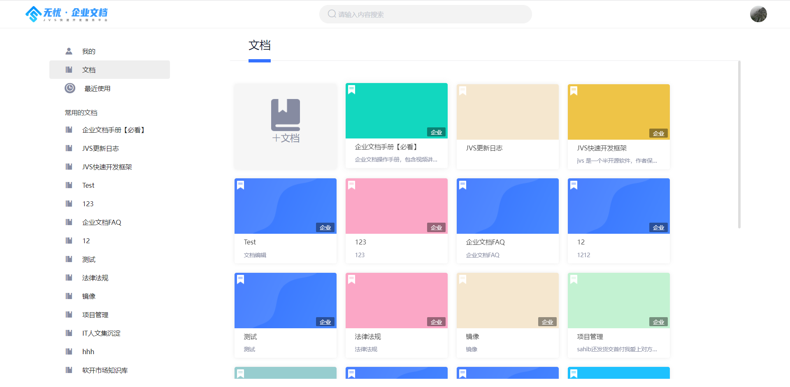
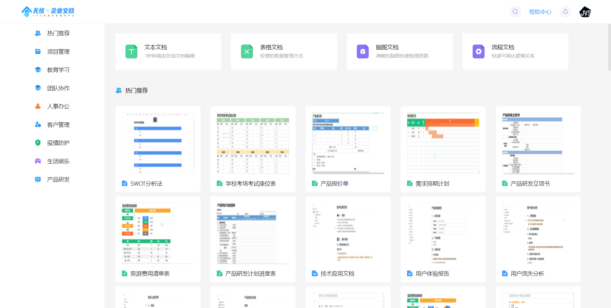
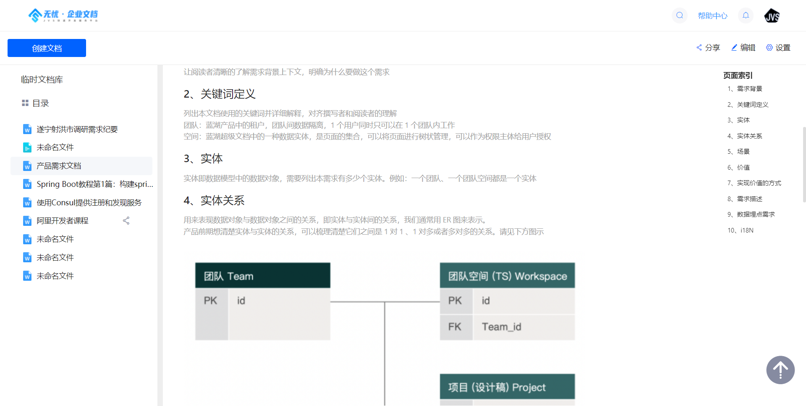
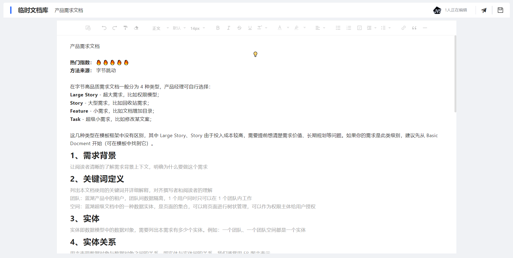
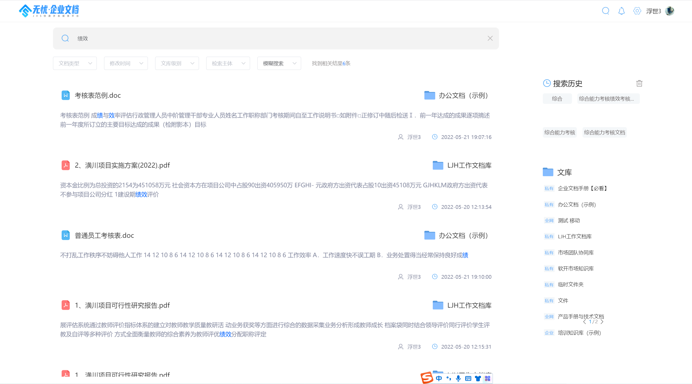
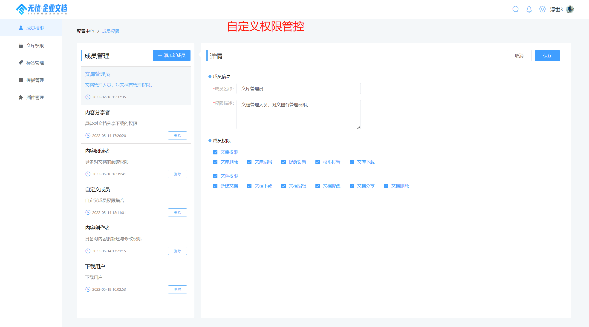

### 适用场景：
* 适用于企业、团队，提供在线笔记、知识沉淀、在线产品手册、知识库、在线电子教程等功能。

### 解决的问题：
-  **数据资产化的问题** ：没有合适的文件管理工具，很难对员工无形知识转化为企业的有形资产，导致培训、学习、展示上浪费了大量的资源，而且效果还不尽人意。
-  **文件统一管控问题** ：数据文件分散在员工各自的电脑中，很难形成有效的统一管控，需要从文件的生成、使用、流动整个过程对 非结构化内容进行管理
-  **知识流动的问题** ：信息的流动速度是企业高效运转的重要保障，解构化的数据由业务系统管理起来，但是非结构化的信息确实可靠的流动渠道，基本靠吼、靠U盘，靠问
-  **信息的检索问题** ：文件由于没有解构化，所以不便于检索查找，是缺乏一个有效的企业级“百度”
-  **信息安全的问题** ：企业内部无法有效的分级管理文件，放在互联网上的SaaS平台又存在信息泄露风险，私有化+内部权限管控是基础

**无忧·企业文档=企业级知识库+在线编辑工具集+企业搜索引擎+内容展示平台**

### 技术栈选择

- 前端：VUE+Element-ui
- 后端：spring_cloud_alibaba、spring boot、Mybatis plus、Nacos、RabbitMq、Xxl-job
- 数据：Mysql、ElasticSearch、Redis、MariaDB（根据情况）
- 运维：K8S+docker

### 项目价值
* 使用低成本，超过30个用户产品的使用时，成本低于SaaS产品，且无用户数的限制
* 信息安全，私有化部署（实体服务器或者私有云），私有化的核心是数据可控，不存在数据控制归第三方
* 技术开放，采用通用技术栈，支持100%代码开放，支持二次开发，不会被任何服务商绑架
* 公司化运作，项目是公司级商业运营项目，是项目持续化迭代与支持服务的重要保障
* 技术支持，支持项目推进的团队属于行业行业资深人员
* 扩展性思考，项目属于企业数字化转型的其中一部分，吸取钉钉、飞书、等大平台的很多经验借鉴，且对互联网、C端相关的能力做了大量裁剪与调整，吸收了大量的to B的产品设计的思路与经验。

### 核心功能：
* 集成多种文件编辑器（富文本编辑器、在线表格、在线脑图、在线流程图等，编辑器将会持续扩展）
* 多种文件的预览解析（PDF、Word、PPT、Excel等多种文件预览）
* 核心文档的协同编辑（富文本与在线表格）
* 支持团队化协同操作（）
* 提供企业级搜索引擎（基于标题、基于内容）
* 支持文档内容评论与文档收藏
* 支持文档分享（密码二次校验设置）
* 支持文档模板
* 企业级组织构架与权限管理（刚性组织+柔性群组）
#### 文集（知识库）管理
* 全站智能搜索引擎，支持文档级、内容级检索
* 文集的增删改查
* 文集的团队成员协作（可查看、可编辑）
* 文集的目录结构化管理
* 文集的基础介绍
* 知识库的参与协作人员
* 支持多种角色协同（成员、管理者、所有者）
#### 文档管理：
* 支持富文本（类word）、脑图（类Xmind）、流程图（类viso）
* 文档的增删改查、文档在线编辑
* 文档的分享设置
#### 富文本编辑：
* 文本大纲，小标题导航
* 支持所见即所得
* 支持表格
* 支持图片、表格、三方应用、音频、视频、等富文本表达插件
* 支持代码块、引用、
* 支持源代码查看

## 项目组成
企业文档分为业务前台与管理后台，项目由 业务前台与业务后台组成：

- 业务前台前端地址：https://github.com/RKQF-JVS/jvs-knowledge-ui
- 业务前台后端地址：https://github.com/RKQF-JVS/jvs-apply-document
- 管理后台前端地址：https://github.com/RKQF-JVS/jvs-ui
- 管理后台后端地址：https://github.com/RKQF-JVS/jvs

## 演示地址
演示地址：http://knowledge.bctools.cn/
试用账号：微信扫码即可登陆，如需要账号密码试用，请二维码联系我们

部分截图：

-

-

-

### 快速部署文档
https://github.com/RKQF-JVS/jvs-docker-compose/blob/master/readme.md

### 使用与授权
无忧企业文档社区版本100%开源模式，在合规备案情况下，支持自用与商用，商用提供100%源代码。
### 版本说明：
使用用途|费用模式|使用条件|授权时间
-|-|-|-
个人学习|免费|免费备案|永久
商用、二次开发|收费、代码交付|技术服务合同+商用备案|永久

### 商用费用说明：
> 技术服务费，必选，具体费用请与商务沟通
> 定制开发费，可选，1500元/人天
> 部署费用，可选，500元/次
> 长期运维，可选，协商

备案说明：联系我们的商务人员，在线备案，备案内容：项目名称，使用模式（自用/商用），备案主体主体，备案联系人员，即可。
### 禁止行为（为了保障产品走得更远）：
* 在未获得我方认可分发代码的情况下，禁止以任何形式进行代码分发（包含但不限于代码拷贝、代码公开、代码开源、代码分享等行为）
* 禁止在未备案的情况下，私自使用（包含自用与商用）

### 技术交流与商务支持

### 历史更新记录：
V1.3  20211202 

* 修改部分UI展示图
* 添加多种文件格式在线预览
* 添加软件介绍页
* 添加当前租户下与组织内人员查看
* 添加知识库背景替换
* 修复部分BUG

### 当前版本
V1.5
* 支持多人在线同时协同编辑
* 优化画图功能
* 文档知识库分享
* 模板管理
* 接入WPS
